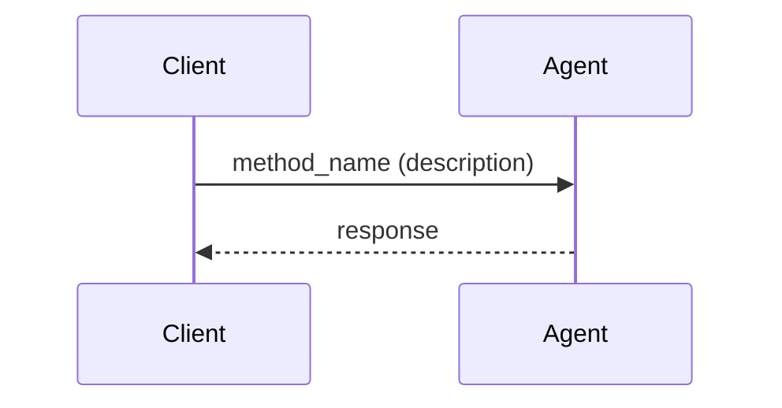

# CLAUDE.md

This file provides guidance to Claude Code (claude.ai/code) when working with code in this repository.

## Architecture

Go implementation of the Agent Client Protocol (ACP), a JSON-RPC 2.0-based communication protocol between AI agents and clients. Provides type-safe bidirectional communication with auto-generated types from the official JSON schema.

Key components:
- AgentConnection/ClientConnection: Symmetric wrappers around jsonrpc2.Conn
- HandlerRegistry: Type-safe method/notification handling with automatic marshaling
- Generated Types: Auto-generated Go structs from upstream JSON schema
- Transport Layer: Extensible system (currently stdio)

Protocol flow: Initialize → Authenticate → Sessions → Operations

Code generation: `make fetch-schema` downloads schemas, `make generate` creates Go types and constants.

Testing uses mock transports, connection pairs, and testify suites for testing coverage.

# Development Workflow

After making changes to Go files:
1. Implement generalizable solutions that work for all valid inputs
2. Run `make check` to verify code quality (test + fmt + vet + lint)
3. Ensure all tests pass before considering the task complete

# Common Commands

- `make setup` - Install tools and dependencies
- `make fetch-schema` - Download latest schema from upstream
- `make generate` - Generate Go types and constants
- `make build` - Build all packages
- `make test` - Run all tests
- `make check` - Run test + fmt + vet + lint
- `make examples` - Build example binaries
- `go test ./acp -run TestName` - Run specific test
- `go test -v ./acp` - Run tests with verbose output

# Coding Standards

- Place constructors (New*) before methods
- Use `ID` not `Id` (sessionID, optionID)
- Replace unused parameters with `_`
- Use `fmt.Errorf("message: %w", err)` for error wrapping
- Use `errors.As(err, &target)` for error assertions
- Use `for i := range n` instead of `for i := 0; i < n; i++` (Go 1.22+)
- Use `s.Require().NoError()` for critical test assertions
- Use `s.Len()` and `s.Empty()` for collection checks
- End comments with periods and document all exports
- Accept `context.Context` as first parameter, use `_` if unused

# Documentation Standards

## Language and Tone

- Use professional, measured language in documentation
- Avoid promotional or marketing language
- Prefer simple, direct descriptions over elaborate ones
- Examples of preferred language:
  - "demonstrates" instead of "comprehensively demonstrates"
  - "agent implementation" instead of "complete/full-featured agent"
  - "error handling" instead of "robust/comprehensive error handling"
  - "file system integration" instead of "complete file system integration"
  - "formatting" instead of "rich formatting"

## Diagrams and Visual Documentation

- Use Mermaid syntax for all diagrams in Markdown files
- For sequence diagrams showing protocol flows, use `sequenceDiagram`
- For architecture diagrams, use `graph` or `flowchart`
- For state machines, use `stateDiagram`
- Avoid ASCII art diagrams in favor of proper Mermaid syntax
- Example sequence diagram format:

# Implementation Guidelines

When working with this codebase:
- Understand the context: This is a production JSON-RPC library requiring high reliability
- Follow schema-driven development: Generated types ensure protocol compliance
- Prioritize type safety: Use the HandlerRegistry for automatic marshaling
- Test thoroughly: Add tests for both success and error scenarios
- Maintain backwards compatibility: Changes must not break existing agent/client implementations

Task execution:
- Request clarification if requirements are ambiguous
- Implement solutions rather than partial implementations
- Prefer editing existing files over creating new ones
- Run the full development workflow before considering tasks complete
