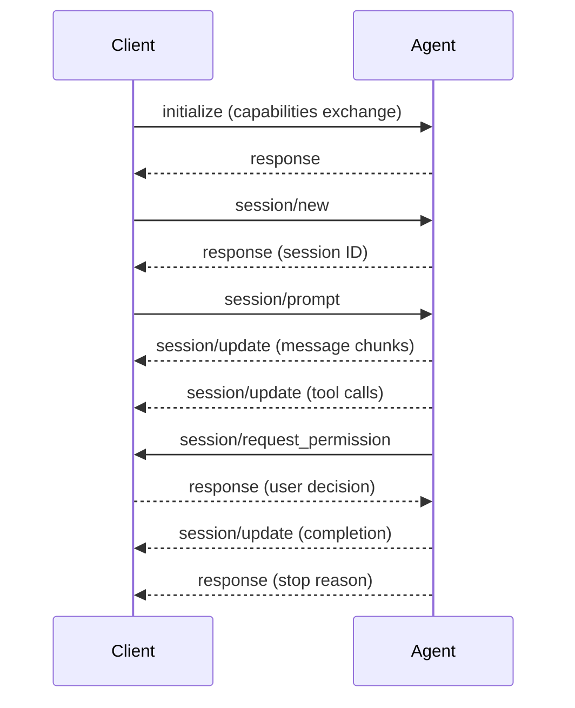

# ACP Go Examples

This directory contains examples demonstrating the [Agent Client Protocol (ACP)](https://agentclientprotocol.com) Go implementation. These examples show how to build agents and clients that communicate using the ACP specification.

## What You'll Learn

- **Agent Implementation** (`agent/`): Session management, tool calls, and permission handling
- **Client Implementation** (`client/`): Subprocess management and interactive communication
- **Protocol Flow**: Initialize → Session → Prompt → Updates → Completion
- **Permission System**: User consent for file operations
- **Tool Execution**: File system operations with status updates

## Quick Start

```bash
# Run the interactive client (spawns agent automatically)
go run ./examples/client ./examples/agent
```

This starts an interactive session where you can send messages to the agent. The agent will demonstrate file operations and permission requests.

### Testing with Raw JSON-RPC

```bash
# Send initialize message to agent
echo '{"jsonrpc":"2.0","id":1,"method":"initialize","params":{"protocolVersion":1,"clientCapabilities":{"fs":{"readTextFile":true}}}}' | go run ./examples/agent
```

## Example Session

```
[CLIENT] Starting agent: ./examples/agent []
[CLIENT] Connected to agent (protocol v1)
[CLIENT] Session created: sess_1693123456

You: Hello! Can you help me with my project?
Agent: I'll help you with that. Let me analyze the request and read some files.

[TOOL] PENDING Reading project files (read)
[TOOL UPDATE] COMPLETED Reading project files

Based on my analysis, I need to make some changes.

[PERMISSION] Agent requested permission for: Writing configuration file
    Tool kind: edit
    Affected locations: /tmp/acp_agent_output.json

Auto-allowing: Allow file write

[TOOL] PENDING Writing configuration file (edit)
[TOOL UPDATE] COMPLETED Writing configuration file

Perfect! I've completed the requested changes.

[CLIENT] Agent completed with stop reason: end_turn

You: quit
```

## Implementation Guide

### Agent Architecture

The agent (`agent/main.go`) demonstrates:

- **Handler Registration**: ACP method handlers for initialize, session management
- **Tool Execution**: File read/write operations with permission requests
- **Session Updates**: Real-time progress updates to client
- **Cancellation**: Context-based cancellation support

### Agent Capabilities

```go
AgentCapabilities{
    LoadSession: true,  // Session restoration support
}
```

### Tool Call Flow

1. Agent sends tool call notification (`session/update`)
2. For sensitive operations, requests permission (`session/request_permission`)
3. Executes tool operation (file read/write)
4. Sends completion update with results

### Client Architecture

The client demonstrates:

- **Subprocess Management**: Spawns and manages agent processes
- **Interactive Interface**: Command-line interaction with agent
- **Permission Handling**: User consent prompts for file operations
- **File Operations**: Handles agent read/write requests
- **Session Updates**: Displays agent progress in real-time

### Client Capabilities

```go
ClientCapabilities{
    Fs: &FileSystemCapability{
        ReadTextFile:  true,
        WriteTextFile: true,
    },
}
```

## Protocol Flow



## Integration Patterns

### Agent Setup

```go
registry := acp.NewHandlerRegistry()
registry.RegisterSessionPromptHandler(handlePrompt)
conn, err := acp.NewAgentConnectionStdio(ctx, stdio, registry, timeout)
```

### Client Setup

```go
registry := acp.NewHandlerRegistry()
registry.RegisterSessionUpdateHandler(handleUpdates)
conn, err := acp.NewClientConnectionStdio(ctx, stdio, registry, timeout)
```

### Permission Requests

```go
response, err := conn.SessionRequestPermission(ctx, &api.RequestPermissionRequest{
    SessionId: sessionId,
    ToolCall:  toolCall,
    Options:   []api.PermissionOption{allowOption, rejectOption},
})
```

## Testing

### Manual Testing

1. Send prompts and verify responses
2. Test permission flow with file operations
3. Test cancellation with 'cancel' command
4. Test error handling with invalid inputs

## Editor Integration

These examples work with ACP-compatible editors like [Zed](https://zed.dev):

```json
{
  "agent_servers": {
    "Go Agent": {
      "command": "/path/to/your/agent",
      "args": []
    }
  }
}
```

## Extending

### Adding Tool Calls

1. Define tool kind constants
2. Implement execution logic
3. Add permission requests for sensitive operations
4. Update client to handle new tool types

### Custom Content Types

1. Add content block handlers
2. Update session update processing
3. Add client UI elements for new content

## Troubleshooting

### Common Issues

1. **Connection Errors**: Verify compatible protocol versions
2. **Permission Timeouts**: Check timeout handling in requests
3. **Process Cleanup**: Ensure proper subprocess resource cleanup
4. **JSON-RPC Errors**: Validate message formatting

### Log Prefixes

- `[CLIENT]` - Client operations
- `[FILE]` - File operations
- `[PERMISSION]` - Permission handling
- `[INIT]` - Agent initialization
- `[SESSION]` - Session management
- `[TOOL]` - Tool execution

## Next Steps

1. Use these examples as templates for your agent
2. Add capabilities specific to your use case
3. Integrate with development tools or editors
4. Add production-ready error handling and configuration

For more information, visit [agentclientprotocol.com](https://agentclientprotocol.com).