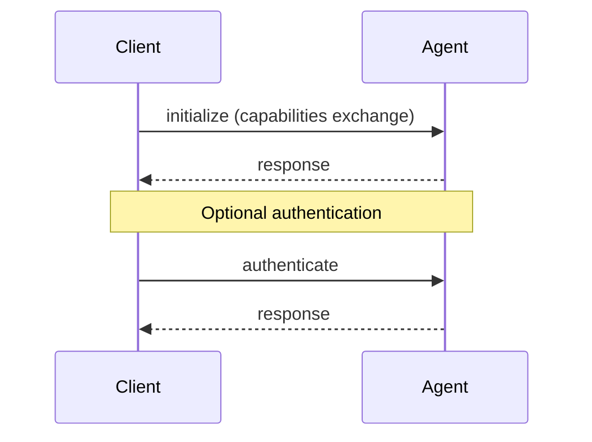
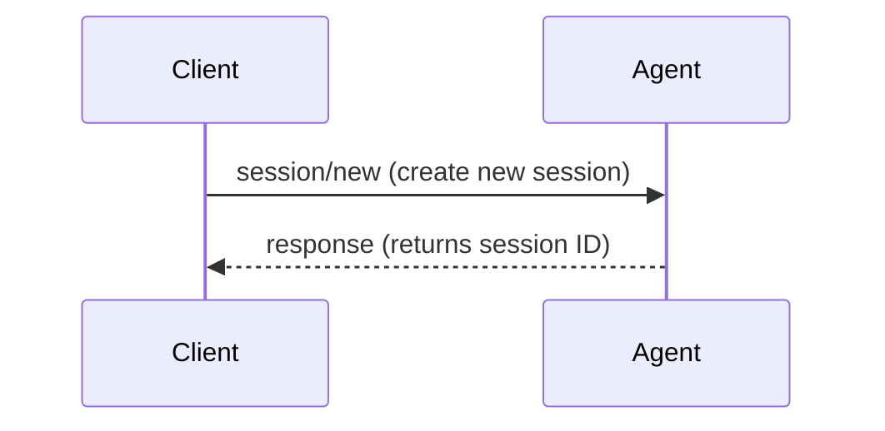
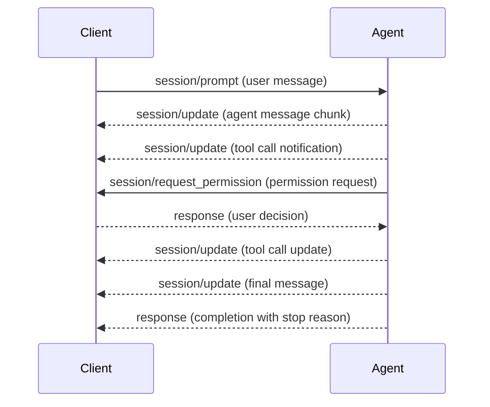
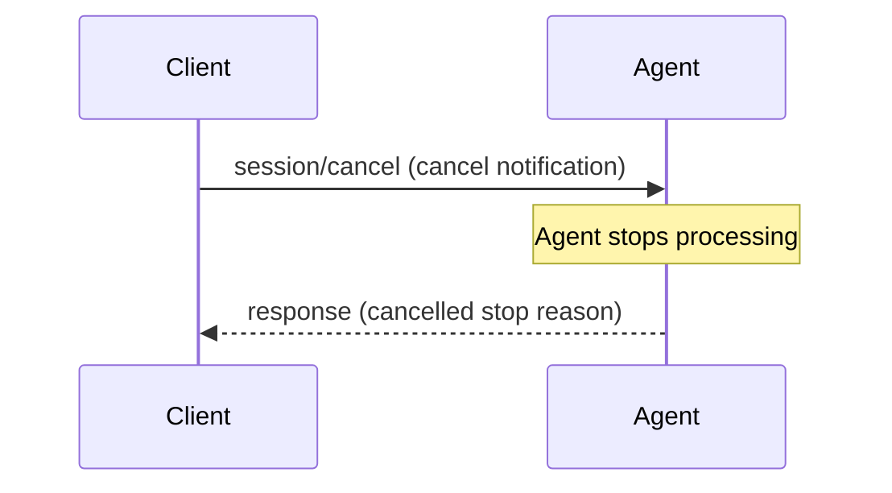

# ACP Go Examples

This directory contains examples demonstrating the [Agent Client Protocol (ACP)](https://agentclientprotocol.com) Go implementation. These examples show how to build both agents and clients that communicate using the ACP specification.

## Overview

The examples demonstrate:

- **Agent Implementation** (`agent/`): An agent with session management, tool calls, and permission handling
- **Client Implementation** (`client/`): A client that spawns agents as subprocesses and provides interactive communication
- **ACP Workflow**: Initialize → Authenticate → Session → Prompt → Updates → Completion
- **Permission System**: How agents request permissions and clients handle them
- **Tool Call Lifecycle**: Tool execution with status updates
- **Cancellation Support**: Handling of session cancellation
- **Error Handling**: Error handling throughout the communication

## Quick Start

### Building the Examples

```bash
# From the project root
go build -o examples/agent/agent ./examples/agent
go build -o examples/client/client ./examples/client
```

### Running Agent and Client Together

The easiest way to see the examples in action:

```bash
# Terminal 1: Start the interactive client (which spawns the agent automatically)
go run ./examples/client ./examples/agent/agent

# Or using the built binaries:
./examples/client/client ./examples/agent/agent
```

This will:
1. Start the client
2. Client spawns the agent as a subprocess 
3. Client establishes ACP connection with the agent
4. Interactive prompt appears for you to chat with the agent

### Running Agent Standalone

You can also run the agent directly to send raw JSON-RPC messages:

```bash
# Start the agent
go run ./examples/agent

# In another terminal, send raw JSON-RPC:
echo '{"jsonrpc":"2.0","id":1,"method":"initialize","params":{"protocolVersion":1,"clientCapabilities":{"fs":{"readTextFile":true,"writeTextFile":true}}}}' | go run ./examples/agent
```

## Example Session

Here's what a typical interaction looks like:

```
[CLIENT] Starting agent: ./examples/agent/agent []
[CLIENT] Agent process started (PID: 12345)
[CLIENT] Establishing connection with agent...
[CLIENT] Connected to agent (protocol v1)
[CLIENT] Agent capabilities: LoadSession=true
[CLIENT] Created session: sess_1693123456

=====================================
Agent Client Protocol Demo
=====================================
Type messages to send to the agent.
Type 'quit' or 'exit' to stop.
Type 'cancel' to cancel the current agent operation.
=====================================

You: Hello! Can you help me with my project?
Agent: I'll help you with that. Let me start by analyzing the request and reading some files to understand the current situation.

[TOOL] PENDING Reading project files (read)
   Locations:
     - /project/config.json

[TOOL UPDATE] COMPLETED Reading project files (completed)
   Updated content:
     Operation completed successfully

Based on my analysis, I need to make some changes. Let me modify a configuration file.

[PERMISSION] Agent requested permission for: Modifying configuration file
    Tool kind: edit
    Affected locations:
      - /project/config.json
    Raw input: map[operation:Modifying configuration file path:/project/config.json]

Available options:
  1. Allow this change (allow_once)
  2. Skip this change (reject_once)
Choose an option (1-2): 1
Selected: Allow this change

[TOOL] PENDING Modifying configuration file (edit)
   Locations:
     - /project/config.json

[TOOL UPDATE] COMPLETED Modifying configuration file (completed)
   Updated content:
     Operation completed successfully

Perfect! I've successfully completed the requested changes. The configuration has been updated and the project is ready.

[CLIENT] Agent completed with stop reason: end_turn

You: quit
[CLIENT] Shutting down...
[CLIENT] Closing connection...
[CLIENT] Agent process exited successfully
```

## Agent Example (`agent/main.go`)

The agent example demonstrates:

### Key Features

- **Multi-step Workflow**: Simulates agent behavior with multiple steps
- **Session Updates**: Sends progress updates to the client
- **Tool Calls**: Demonstrates tool call lifecycle (pending → completed)
- **Permission Requests**: Shows how to request user permission for sensitive operations
- **Cancellation Support**: Handling of session cancellation with context
- **Error Handling**: Error handling with appropriate stop reasons

### Capabilities

```go
AgentCapabilities{
    LoadSession: true,  // Can restore previous sessions
    PromptCapabilities: api.PromptCapabilities{
        // Supports various content types and tool calls
    },
}
```

### Architecture

The agent is structured with these key components:

- **Main Handler Registration**: Registers all supported ACP methods
- **Session Management**: Tracks active prompts for cancellation
- **Simulation Engine**: `simulateAgentTurn()` orchestrates the multi-step workflow
- **Tool Call System**: Tool call lifecycle with permission requests
- **Message Streaming**: Sends chunks of agent responses in real-time

### Tool Call Flow

1. **Initial Tool Call**: Sends `session/update` with tool call notification
2. **Permission Request**: For sensitive operations, calls `session/request_permission`
3. **Execution**: Simulates actual tool execution with delays
4. **Completion Update**: Sends final tool call update with results

## Client Example (`client/main.go` + `session_handler.go`)

The client example demonstrates:

### Key Features

- **Subprocess Management**: Spawns and manages agent processes
- **Interactive Interface**: Command-line interface
- **Permission Handling**: Interactive permission prompts with user choice
- **File Operations**: File system integration (read/write)
- **Session Update Display**: Formatting of agent progress updates
- **Graceful Cleanup**: Process termination and resource cleanup

### Capabilities

```go
ClientCapabilities{
    Fs: &FileSystemCapabilities{
        ReadTextFile:  true,  // Can read files for the agent
        WriteTextFile: true,  // Can write files for the agent
    },
}
```

### Architecture

- **Process Management**: Handles agent subprocess lifecycle
- **Connection Setup**: Establishes ACP connection over stdio
- **Interactive Loop**: Handles user input and agent communication
- **Update Handlers**: Processes all types of session updates with formatting
- **Permission UI**: Interactive permission request handling

### Session Update Handling

The client processes different types of session updates:

- **Agent Message Chunks**: Streamed directly to stdout
- **Tool Calls**: Formatted display with status icons
- **Tool Updates**: Progress updates with completion status
- **Plans**: Structured display of agent planning
- **Thoughts**: Internal agent reasoning (logged to stderr)

## Protocol Flow

The examples demonstrate the ACP protocol flow:

### 1. Connection Establishment



### 2. Session Setup



### 3. Prompt Processing



### 4. Cancellation (Optional)



## Usage Patterns

### Basic Agent-Client Communication

```go
// Agent side
registry := acp.NewHandlerRegistry()
registry.RegisterSessionPromptHandler(handlePrompt)
conn := acp.NewAgentConnectionStdio(ctx, stdio, registry.Handler())

// Client side  
registry := acp.NewHandlerRegistry()
registry.RegisterSessionUpdateHandler(handleUpdates)
conn := acp.NewClientConnectionStdio(ctx, stdio, registry.Handler())
```

### Sending Session Updates

```go
// Agent sending message chunks
textContent := api.NewContentBlockText(nil, "Hello from agent")
update := api.NewSessionUpdateAgentMessageChunk(textContent)
conn.SendSessionUpdate(ctx, &api.SessionNotification{
    SessionId: sessionId,
    Update:    update,
})
```

### Tool Call with Permission

```go
// Agent requesting permission
permissionRequest := &api.RequestPermissionRequest{
    SessionId: sessionId,
    ToolCall:  toolCall,
    Options:   []api.PermissionOption{allowOption, rejectOption},
}

var response api.RequestPermissionResponse
err := conn.Call(ctx, api.MethodSessionRequestPermission, permissionRequest, &response)
```

### Handling Different Content Types

```go
// Client handling various content types
if textContent := chunk.Content.GetText(); textContent != nil {
    fmt.Print(textContent.Text)
} else if imageContent := chunk.Content.GetImage(); imageContent != nil {
    fmt.Print("[Image]")
} else if audioContent := chunk.Content.GetAudio(); audioContent != nil {
    fmt.Print("[Audio]")
}
```

## Testing Integration

### Manual Testing

1. **Basic Communication**: Send prompts and verify responses
2. **Permission Flow**: Trigger permission requests and test user choices
3. **Cancellation**: Test cancelling long-running operations
4. **Error Handling**: Test invalid inputs and network issues
5. **File Operations**: Test file read/write operations

### JSON-RPC Testing

You can test the raw protocol by sending JSON-RPC messages:

```bash
# Initialize connection
echo '{"jsonrpc":"2.0","id":1,"method":"initialize","params":{"protocolVersion":1,"clientCapabilities":{}}}' | go run ./examples/agent

# Create session
echo '{"jsonrpc":"2.0","id":2,"method":"session/new","params":{"cwd":"/tmp","mcpServers":[]}}' | go run ./examples/agent

# Send prompt
echo '{"jsonrpc":"2.0","id":3,"method":"session/prompt","params":{"sessionId":"sess_123","prompt":[{"type":"text","text":"Hello"}]}}' | go run ./examples/agent
```

## Integration with Real Editors

These examples are designed to be compatible with real ACP clients like [Zed Editor](https://zed.dev). You can configure Zed to use your Go agent:

```json
{
  "agent_servers": {
    "Go Example Agent": {
      "command": "/path/to/your/agent",
      "args": []
    }
  }
}
```

## Extending the Examples

### Adding New Tool Calls

1. Create new tool kind constants in your agent
2. Implement the tool execution logic
3. Add appropriate permission requests if needed
4. Update the client to handle new tool types

### Adding MCP Server Support

The examples include basic MCP server configuration. To add MCP support:

1. Implement MCP server connection management
2. Add MCP tool call forwarding
3. Handle MCP server lifecycle events

### Custom Content Types

Both examples support extending content types:

1. Add new content block handlers
2. Update the session update processing
3. Add appropriate UI elements in the client

## Troubleshooting

### Common Issues

1. **Connection Errors**: Ensure both agent and client use compatible protocol versions
2. **Permission Timeouts**: Implement timeout handling in permission requests  
3. **Process Management**: Ensure cleanup of subprocess resources
4. **JSON-RPC Errors**: Check message formatting and method names

### Debug Mode

Set environment variable for detailed logging:
```bash
export ACP_DEBUG=1
go run ./examples/client ./examples/agent/agent
```

### Log Analysis

Agent logs are prefixed with:
- `[INIT]` - Initialization
- `[SESSION]` - Session management
- `[PROMPT]` - Prompt processing
- `[TOOL]` - Tool execution
- `[PERMISSION]` - Permission handling
- `[CANCEL]` - Cancellation

Client logs are prefixed with:
- `[CLIENT]` - Client operations
- `[FILE]` - File operations
- `[UPDATE]` - Session updates
- `[PERMISSION]` - Permission handling

## Next Steps

After exploring these examples:

1. **Build Your Own Agent**: Use these as templates for your specific use case
2. **Add More Capabilities**: Implement additional client capabilities
3. **Integration**: Connect your agent to real editors or development tools
4. **Production Deployment**: Add error handling, logging, and configuration management

For more information about the Agent Client Protocol, visit [agentclientprotocol.com](https://agentclientprotocol.com).